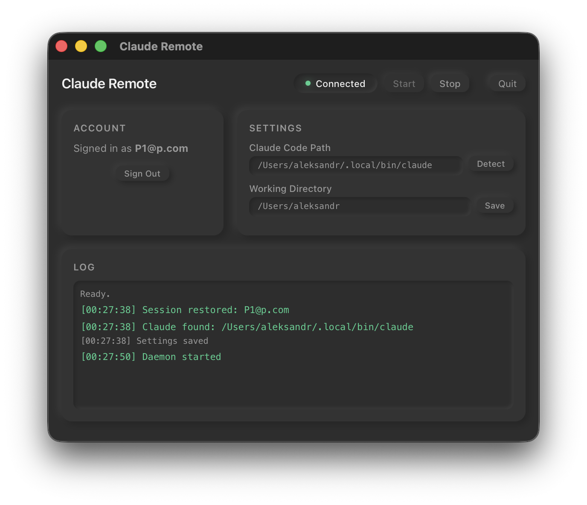

# Claude Remote

Control [Claude Code](https://claude.ai/claude-code) on your Mac from any browser or phone.

Send coding tasks remotely — get AI-powered responses streamed back in real time.


## How It Works

1. **Install the app** on your Mac — it lives in the menu bar
2. **Open the web chat** from your phone or any browser
3. **Send a message** — it reaches your Mac instantly, Claude Code runs the task and streams back the result

## Desktop App

Lightweight Tauri tray app with neumorphic UI, auto-detect Claude Code path, and live connection status.



## Features

- **Mobile access** — full chat with Claude Code from iPhone, Android, or any browser
- **Instant delivery** — Firebase Realtime Database, messages delivered in milliseconds
- **Secure** — Firebase Auth, each user can only access their own sessions
- **Lightweight** — just an icon in your menu bar, minimal resource usage
- **Auto-updates** — built-in updater checks for new versions on launch

## Download

**[Download Claude Remote for macOS (Apple Silicon)](https://chilin1.web.app/releases/Claude%20Remote_0.1.0_aarch64.dmg)**

### Installation

macOS may show a warning for apps downloaded outside the App Store:

1. Open the `.dmg` and drag Claude Remote to Applications
2. Try to open the app — macOS will block it
3. Go to **System Settings → Privacy & Security**, scroll down and click **Open Anyway**
4. Enter your password — done! The app opens normally from now on

## Tech Stack

| Component | Technology |
|-----------|-----------|
| Desktop app | [Tauri v2](https://v2.tauri.app/) (Rust + HTML/JS) |
| Backend | Firebase Realtime Database |
| Auth | Firebase Authentication |
| Web chat | Vanilla JS + marked.js + highlight.js |
| Hosting | Firebase Hosting |
| Auto-update | Tauri updater (minisign) |

## Project Structure

```
claude-remote/
  app/                    # Tauri desktop application
    src/                  # Frontend (HTML/JS settings window)
    src-tauri/            # Rust backend (auth, daemon, tray)
  web/                    # Firebase Hosting
    public/
      index.html          # Landing page (EN)
      ru/index.html       # Landing page (RU)
      chat.html           # Web chat
      releases/           # DMG downloads + update manifest
```

## Building from Source

### Prerequisites

- [Rust](https://rustup.rs/)
- [Node.js](https://nodejs.org/) (v18+)
- [Claude Code](https://claude.ai/claude-code) installed on your Mac

### Build

```bash
cd app
npm install
npm run tauri build
```

The built `.app` and `.dmg` will be in `app/src-tauri/target/release/bundle/`.

## Links

- **Web chat:** https://chilin1.web.app/chat.html
- **Landing page:** https://chilin1.web.app

## License

MIT
